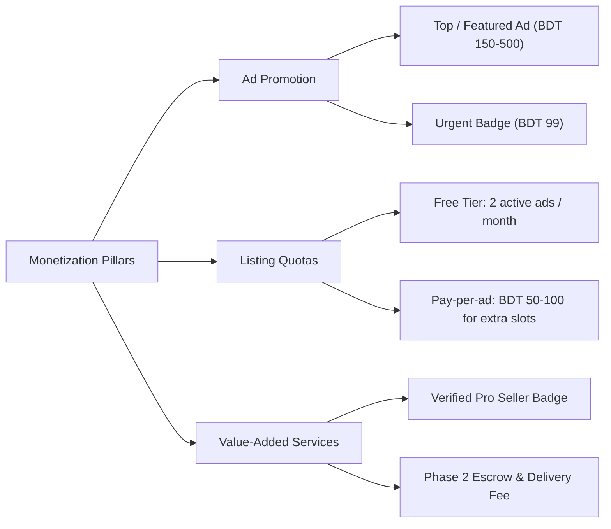
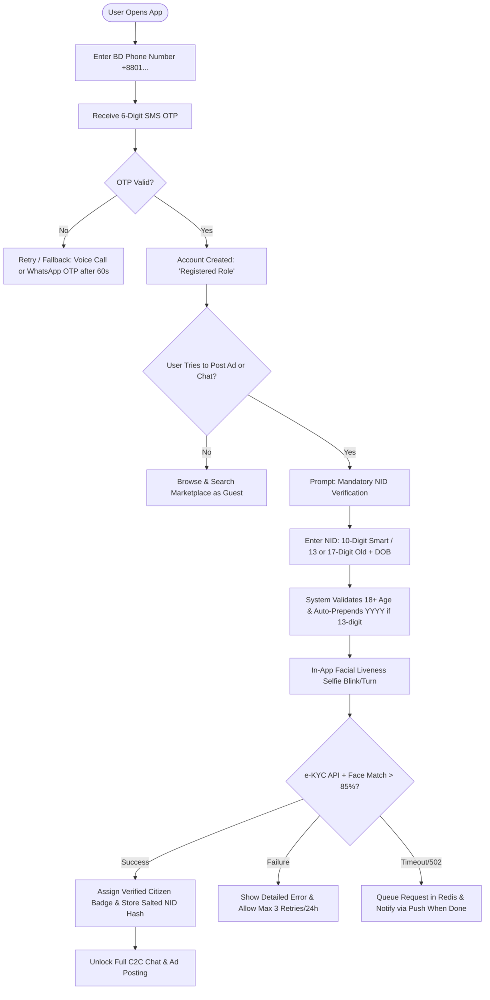
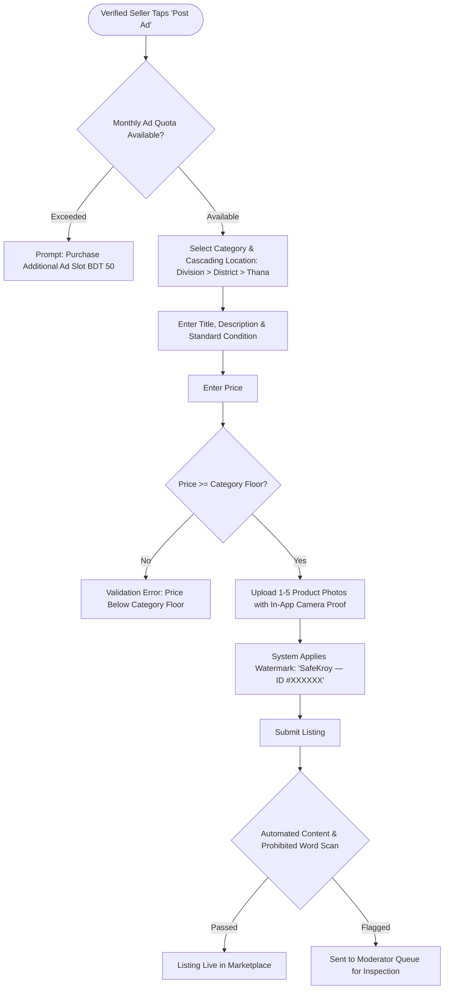
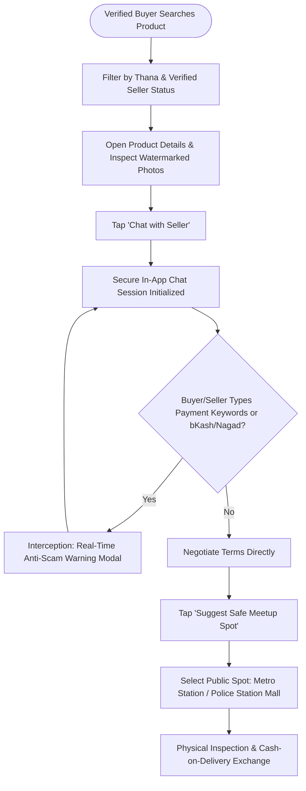
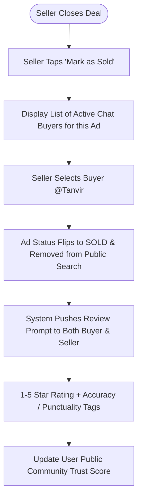
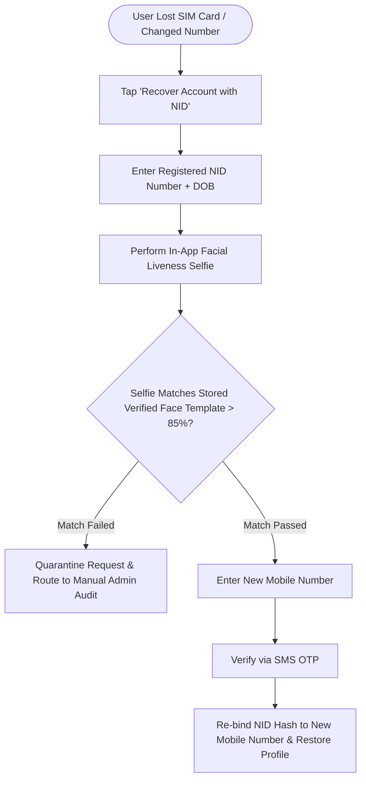
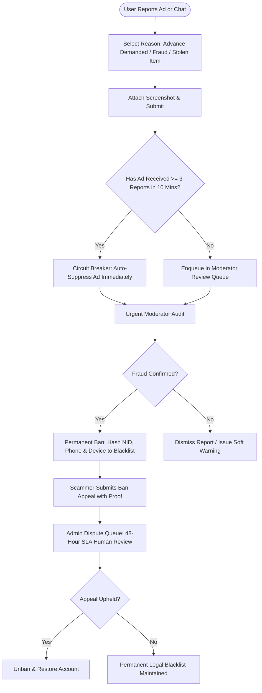

# Product Requirements Document (PRD)

## Project Name: SafeKroy (Amar-Bazar)
**Tagline:** *The Safest C2C Second-Hand Marketplace in Bangladesh*  
**Document Version:** 1.2.0 (Production-Ready Architecture Specification)  
**Status:** Approved & Ready for Technical Implementation  
**Target Release:** MVP (Phase 1)  
**Base Inputs:** [`Idea.md`](file:///c:/Users/Tarikul/Documents/Amar-Bazar/Idea.md), [`prd-analysis.md`](file:///c:/Users/Tarikul/Documents/Amar-Bazar/prd-analysis.md), [`Requirement-Validation.md`](file:///c:/Users/Tarikul/Documents/Amar-Bazar/Requirement-Validation.md)

---

## 1. Project Overview & Business Strategy

### 1.1 Executive Summary
**SafeKroy** is an identity-first, customer-to-customer (C2C) classifieds marketplace engineered specifically to eliminate online scams, counterfeit profiles, and advance-payment fraud in Bangladesh. While legacy platforms (e.g., Bikroy, Facebook Marketplace/Groups) suffer from rampant anonymity and unverified sellers soliciting fake bKash/Nagad courier charges, SafeKroy enforces **mandatory dual-sided National ID (NID/Smart Card) e-KYC verification with biometric liveness checks** before users can publish ads or initiate buyer-seller communication.

```
┌────────────────────────────────────────┐       ┌────────────────────────────────────────┐
│      Incumbents (Bikroy / Facebook)    │       │         SafeKroy Ecosystem             │
├────────────────────────────────────────┤       ├────────────────────────────────────────┤
│ • Zero legal identity verification     │       │ • Mandatory Dual-Sided NID e-KYC       │
│ • Burner SIMs & throwaway accounts     │  vs   │ • 1 NID = 1 Unique Account Binding     │
│ • Rampant bKash/Nagad advance fraud    │       │ • Real-Time In-Chat Keyword Interceptor│
│ • Zero recourse or accountability      │       │ • Permanent NID Blacklisting & Ban     │
│ • No reputation or rating loop         │       │ • Post-Deal Mutual Trust Score (1-5★)  │
└────────────────────────────────────────┘       └────────────────────────────────────────┘
```

### 1.2 Core Problems Solved
1. **Advance Payment & Courier Scams:** Fraudulent sellers demanding advance "delivery charge / booking token" via bKash/Nagad and disappearing.
2. **Identity Masking & Recidivism:** Scammers repeatedly creating new profiles with burner SIMs when banned.
3. **The "Weaponized Trust Badge" Vulnerability:** Preventing verified bad actors from using their green verified badge as false credibility to solicit off-platform advance cash.
4. **Phone Number Harvesting:** Protecting user privacy against automated telemarketing scrapers.
5. **Lack of Transaction Reputation:** Eliminating the information asymmetry of second-hand goods through deal-linked mutual reviews.

### 1.3 Key Value Propositions
* **For Buyers:** Browse and negotiate pre-owned goods exclusively with legal citizens whose identities are verified, backed by an immutable trust score and protected by in-app anti-scam shields.
* **For Sellers:** Sell items rapidly to authentic, verified buyers without harassment, bogus counter-offers, or no-show meetings.

### 1.4 Monetization Roadmap & Unit Economics
To maintain sustainable unit economics in Bangladesh while absorbing third-party e-KYC expenses, SafeKroy implements a multi-tier monetization engine:



1. **Ad Promotion Features:**
   - **Featured / Top Ad:** Fixed pin at top of category & search results for 7 or 14 days (BDT 150–500).
   - **Urgent Badge:** Visual highlight badge attracting quick buyers within 48 hours (BDT 99).
2. **Listing Quotas & Commercial Restrictions:**
   - C2C users receive **2 free active ads per calendar month**.
   - Additional listings require a micro-fee (BDT 50–100 per ad) to prevent commercial refurbishers and mobile shops from flooding the marketplace for free.
3. **Verified Pro Seller Program (Future Phase):**
   - High-volume certified merchants pay a monthly subscription for extended quotas, profile storefronts, and verified business badges.

### 1.5 e-KYC Cost Control & Absorption Strategy
Each government e-KYC query (via Porichoy / Election Commission) costs approximately **BDT 2.00 to BDT 5.00**. To prevent unsustainable cash burn from casual signups:
1. **Delayed Verification Trigger:** Registration via phone OTP is completely free. e-KYC is **only triggered when a user attempts to post an ad or contact a seller**.
2. **Free Lifetime Verification Quota:** Each unique citizen (NID) and verified phone number receives **1 free lifetime verification**.
3. **Abuse Mitigation:** Submissions are rate-limited to a maximum of **3 attempts per 24-hour window**. Failed attempts exceeding the quota require manual moderation review or a nominal processing fee.

---

## 2. User Hierarchy & Role-Based Access Control (RBAC)

SafeKroy defines a structured **5-tier role hierarchy** ensuring appropriate access boundaries across the platform lifecycle:

```
                            User Privilege Ladder
┌───────────────────────────┬─────────────────────────────────────────────────────────┐
│ Role                      │ Permissions Summary                                     │
├───────────────────────────┼─────────────────────────────────────────────────────────┤
│ 1. Guest (Anonymous)      │ Public discovery, search, view ad specs.                │
│ 2. Registered (Unverified)│ Phone OTP verified. Save favorites, view own profile.   │
│ 3. Verified Citizen (NID) │ Post ads (quota), C2C chat, reveal phone, post review.  │
│ 4. Community Moderator    │ Audit flagged ads/chats, issue warnings, suppress ads.  │
│ 5. Super Admin            │ Permanent NID blacklisting, raw audit logs, system keys.│
└───────────────────────────┴─────────────────────────────────────────────────────────┘
```

### 2.1 RBAC Matrix

| Action / Capability | Guest | Registered (Unverified) | Verified Citizen (NID) | Community Moderator | Super Admin |
| :--- | :---: | :---: | :---: | :---: | :---: |
| Search & Browse Listings | ✅ | ✅ | ✅ | ✅ | ✅ |
| Save Ads to Favorites | ❌ | ✅ | ✅ | ✅ | ✅ |
| Post New Ad | ❌ | ❌ | ✅ (2 free/month) | ❌ | ✅ |
| Initiate C2C In-App Chat | ❌ | ❌ | ✅ | ❌ | ✅ (Audit only) |
| Request Phone Number Reveal | ❌ | ❌ | ✅ (Max 5/day) | ❌ | ✅ |
| Edit / Delete Own Ad | ❌ | ❌ | ✅ | ❌ | ✅ |
| Mark Ad as "Sold" to Buyer | ❌ | ❌ | ✅ | ❌ | ✅ |
| Leave Post-Sale Mutual Review | ❌ | ❌ | ✅ | ❌ | ❌ |
| Flag / Report Ad or User | ❌ | ✅ | ✅ | ✅ | ✅ |
| Review Flagged Moderation Queue | ❌ | ❌ | ❌ | ✅ | ✅ |
| Suppress / Hide Questionable Ad | ❌ | ❌ | ❌ | ✅ | ✅ |
| Permanently Blacklist NID Hash | ❌ | ❌ | ❌ | ❌ | ✅ |
| View Raw KYC Audit Logs | ❌ | ❌ | ❌ | ❌ | ✅ |

---

## 3. Core Features & Functional Requirements

```
                                SafeKroy Feature Architecture
                                              │
        ┌─────────────────────┬───────────────┴───────────────┬─────────────────────┐
        ▼                     ▼                               ▼                     ▼
  1. Identity &         2. Ad Lifecycle &               3. Smart Discovery &   4. Safe Communication
     Verification          Quotas                          Geo-Filtering          & Anti-Scam Shield
     - e-KYC Gateway       - 2 Free/Month                  - Division > Thana     - Real-Time Interceptor
     - 10/13/17 NID        - Price Floors                  - Safe Meetup Spots    - Number Masking
     - Face Liveness       - Condition Standard            - Fast Full-text       - Mutual Review Loop
     - 1:1 Binding         - Re-moderation Gate            - Image Watermarking   - Ban Appeal Flow
```

### 3.1 Module 1: Identity & NID e-KYC Verification Engine
* **FR-1.1 Mobile OTP Registration:** Users sign up with a valid Bangladeshi mobile number (`+8801[3-9]\d{8}`). Verification via 6-digit SMS OTP (5-minute expiry). Voice-call and WhatsApp OTP fallbacks trigger after 60 seconds of telco delay.
* **FR-1.2 Multi-Format NID Support:**
  - **10-Digit Smart Card:** Direct query to national e-KYC gateway.
  - **13-Digit Legacy Paper NID:** The system extracts the 4-digit birth year from the user's entered Date of Birth (DOB) and automatically prepends it, creating the 17-digit format required by the Election Commission.
  - **17-Digit Legacy NID:** Direct query.
* **FR-1.3 Active Biometric Liveness Check:** Users must capture an in-app selfie performing randomized micro-actions (blink eyes, turn head left/right). The biometric facial match against the official NID photo must exceed **85% confidence**.
* **FR-1.4 Strict 1:1 Identity Binding:**
  - One legal citizen can only hold **one active SafeKroy account**.
  - Enforced via database unique constraint on `SHA-256(NID_Number + Server_Pepper)`.
  - Collision mitigation: If an existing NID is entered, the registration is rejected with: *"This NID is already registered to another account. Please log in with your primary phone number."*
* **FR-1.5 Age Floor (18+ Policy):** Users must be at least 18 years of age (`DOB <= Today - 18 Years`). Minors (<18) are restricted strictly to Guest / Browse-only mode.
* **FR-1.6 Bilingual Name Transliteration Handling:** National databases store legal names in Bengali script (`মোঃ তানভীর আহমেদ`), whereas users may type their profile name in English (`Md. Tanvir Ahmed`). SafeKroy avoids fragile string matching: identity is authenticated strictly via **NID Number + DOB + Biometric Liveness**, and the user's verified Bengali legal name is auto-populated into an uneditable profile field.
* **FR-1.7 SIM Replacement & Biometric Account Recovery:** If a user loses their registered SIM card or changes numbers, they can recover their account by verifying NID + DOB followed by an active facial liveness match against their originally stored NID face template. Upon match (>85%), their NID hash is securely re-bound to the new mobile number.
* **FR-1.8 Fraud Database Integration & Blacklist Vault:** Banned scammers have their salted NID hash, phone hash, and device IDs permanently indexed in an immutable blacklist collection. Any future registration matching these identifiers is immediately rejected.

### 3.2 Module 2: Listing & Ad Lifecycle Management
* **FR-2.1 Fair Usage Monthly Quota:** Individual verified accounts receive **2 free active listings per calendar month**. Additional active listings require purchasing an extra listing slot (BDT 50–100).
* **FR-2.2 Anti-Clickbait Category Price Floors:** Listings cannot be submitted with absurd prices to manipulate sorting filters:
  - Smartphones: Minimum BDT 1,000
  - Laptops: Minimum BDT 3,000
  - Motorbikes / Vehicles: Minimum BDT 20,000
* **FR-2.3 In-App Camera Proof & Dynamic Watermarking:**
  - Upload 1 to 5 images (max 5MB each, JPEG/PNG/WebP, min $600\times 600\text{px}$).
  - At least 1 image must be captured directly via the in-app camera showing the physical item.
  - All published images are automatically processed with an indelible semi-transparent watermark: `SafeKroy — ID #XXXXXX` to prevent scammers from re-uploading images to Facebook or other classifieds.
* **FR-2.4 Standardized Item Condition:**
  - `Like New`: Flawless aesthetic and mechanical condition; original retail box and purchase memo included.
  - `Good`: Minor cosmetic wear/scratches, 100% functional, no hardware defects.
  - `Fair`: Visible wear and tear, battery health degraded, all flaws explicitly disclosed in description.
  - `For Parts / Faulty`: Item has known hardware defects; sold strictly for component salvage.
* **FR-2.5 Ad Edit Re-Moderation Gate:** If an active ad's Title, Category, Images, or Price ($\Delta > 30\%$) are modified, its status flips from `ACTIVE` to `PENDING_REMODERATION` to prevent post-approval bait-and-switch scams.
* **FR-2.6 Deal Closure ("Mark as Sold"):**
  - Sellers can mark an item as `AVAILABLE`, `RESERVED`, or `SOLD`.
  - Marking `SOLD` requires selecting the verified buyer from active chat threads or indicating "Sold outside SafeKroy".
  - Triggers the post-deal Mutual Review Flow.

### 3.3 Module 3: Discovery, Geo-Filtering & Safe Meetups
* **FR-3.1 Standardized Location Taxonomy:** Structured cascading dropdowns: `Division > District > Thana/Upazila`. Free-form custom text locations are disallowed to ensure strict search accuracy.
* **FR-3.2 Safe Meetup Location Suggester:**
  - In-app chat includes a **"Suggest Safe Meetup Spot"** tool.
  - Recommends crowded, CCTV-monitored public locations (e.g., Metro Rail Stations, Shopping Mall Food Courts, Police Station Vicinities) within the agreed Thana.

### 3.4 Module 4: In-App C2C Communication & Anti-Scam Shield
* **FR-4.1 Real-Time In-Chat Keyword Interceptor:**
  - Active regex monitoring for payment keywords: `advance`, `booking`, `agrim`, `bKash`, `Nagad`, `Rocket`, `courier charge`, or 11-digit mobile wallet patterns.
* **FR-4.2 System Interstitial Warning Modal:**
  - When payment keywords or account numbers are typed, the system intercepts message transmission and displays an unskippable modal alert:
    > *"🚨 SAFETY ALERT: SafeKroy strictly prohibits sending advance money or courier booking fees. Verified NID confirms identity, NOT product delivery. Inspect goods in person before paying."*
* **FR-4.3 Anti-Scraping Phone Number Masking:**
  - Seller phone numbers are hidden by default.
  - Verified buyers can click "Reveal Phone Number" (Rate limited to **5 reveals per user per 24 hours**).
  - Numbers are dynamically rendered via server-side SVG or authenticated API to defeat web scraper bots.
* **FR-4.4 Offline Message Queue & Sync:** Messages sent during intermittent mobile connectivity (common on 3G/4G in Bangladesh) are stored in local IndexedDB and automatically dispatched upon socket reconnection.
* **FR-4.5 In-Chat User Block & Mute:** Users can immediately block harassing contacts, revoking chat permissions without needing to file an admin report.
* **FR-4.6 Chat Data Preservation for Legal Disputes:** Messages deleted by users are soft-deleted from the UI but retained in an encrypted, immutable compliance vault for **90 days** to cooperate with law enforcement (CID/DB/Police) in fraud investigations.

### 3.5 Module 5: Reputation & Mutual Review Engine
* **FR-5.1 14-Day Post-Deal Feedback Window:** Triggered immediately when an ad is marked "Sold to @Buyer".
* **FR-5.2 Scoring & Tagging:**
  - Star Rating: 1 to 5 Stars.
  - Positive Tags: *"Item as Described"*, *"Punctual Meetup"*, *"Polite"*, *"Smooth Deal"*.
  - Negative Tags: *"Defective Item"*, *"Demanded Advance Money"*, *"Late / No-Show"*, *"Rude"*.
* **FR-5.3 Community Trust Score:** Aggregate score and total completed transactions displayed on the user's public profile (e.g., `⭐ 4.9 / 14 Verified Transactions`).

### 3.6 Module 6: Trust, Safety, Appeals & Moderation
* **FR-6.1 User Reporting System:** Flagging ads or users with evidence attachments (chat screenshots, call logs).
* **FR-6.2 Automated Circuit Breaker:** Any ad receiving $\ge 3$ unique verified user reports within a 10-minute window is automatically flipped to `TEMPORARILY_SUPPRESSED` and escalated to the Urgent Moderator Queue.
* **FR-6.3 Ban Appeal Flow:** Banned users can submit an appeal with transaction evidence. Admin Dispute Queue operates under a strict **48-hour SLA**.
* **FR-6.4 Device Fingerprinting:** Tracks Hardware UUID, IMEI, and Canvas fingerprint to quarantine new registrations attempted from devices previously tied to confirmed fraud.
* **FR-6.5 Account Deletion vs Fraud History Preservation:** When a user requests account deletion, personal identifiers (name, email) are scrubbed. However, **Salted NID Hash, Phone Hash, and Blacklist flags are permanently preserved** in an immutable fraud vault.

---

## 4. User Flows

### 4.1 Flow 1: User Onboarding, Multi-Format NID & Liveness Verification



---

### 4.2 Flow 2: Seller Ad Posting with Quota, Price Floors & Watermarking



---

### 4.3 Flow 3: Buyer Search, Chat Interception & Safe Meetup



---

### 4.4 Flow 4: Deal Closure ("Mark as Sold") & Mutual Review Flow



---

### 4.5 Flow 5: SIM Replacement & Biometric Account Recovery



---

### 4.6 Flow 6: Abuse Reporting, Circuit Breaker & Ban Appeal



---

## 5. Input Validation Rules & Constraints

```
                            Standardized Input Validation Pipeline
                                              │
            ┌─────────────────────┬───────────┴───────────┬─────────────────────┐
            ▼                     ▼                       ▼                     ▼
      Phone Validation       NID Validation          Price Rules           Media Rules
      +8801[3-9]\d{8}       10, 13, 17 digits       Numeric > 0           Max 5 MB, WebP,
      (Exact 11 digits)     + Date of Birth         Min Category Floor    Min 600x600 px
```

| Field Name | Data Type | Validation Regex / Constraint | Validation Rule & Boundary | User Error Message |
| :--- | :--- | :--- | :--- | :--- |
| **Mobile Number** | String | `^(?:\+?88)?01[3-9]\d{8}$` | Exactly 11 digits starting with valid Bangladeshi mobile telco prefix (013–019). | *"Please enter a valid 11-digit Bangladeshi mobile number."* |
| **NID Number** | String | `^(?:\d{10}\|\d{13}\|\d{17})$` | Strictly numeric; exact length of 10 digits (Smart Card) or 13/17 digits (Legacy NID). | *"Invalid NID. Must be 10 digits (Smart Card) or 13/17 digits (National ID)."* |
| **Date of Birth** | Date | `DOB <= Today - 18 Years` | User must be at least 18 years old on the date of verification. | *"You must be at least 18 years of age to register on SafeKroy."* |
| **Ad Title** | String | Length: $[10, 80]$ chars | Trim leading/trailing whitespace. Prohibit repetitive punctuation (`!!!!`, `????`). | *"Title must be between 10 and 80 characters."* |
| **Ad Description** | String | Length: $[30, 2000]$ chars | XSS sanitization (strip `<script>`, `<embed>`, `<iframe>`). Minimum 30 meaningful characters. | *"Please provide a detailed description (minimum 30 characters)."* |
| **Item Condition** | Enum | `Like New \| Good \| Fair \| For Parts` | Must match one of 4 standardized platform conditions. | *"Please select a valid item condition."* |
| **Price** | Integer | Minimum Category Floor up to BDT 50,000,000 | Integer only. Must be greater than category price floor. No negative or zero values. | *"Please enter a valid price in BDT."* |
| **Product Photos** | Files | $1 \le \text{Count} \le 5$, Size $\le 5\text{MB}$ | Accepted MIME types: `image/jpeg`, `image/png`, `image/webp`. Min dimensions: $600 \times 600\text{px}$. | *"Upload 1 to 5 clear photos under 5MB each."* |
| **Location** | Select | Enum IDs | Must match valid administrative hierarchy: `Division_ID > District_ID > Thana_ID`. | *"Please select a valid Division, District, and Thana."* |
| **Review Rating** | Integer | Range: $[1, 5]$ | Mandatory 1 to 5 stars. Requires at least 1 tag. | *"Please provide a star rating between 1 and 5."* |

---

## 6. Error Handling & System Exceptions

| ID | Failure Point / Exception | Root Cause | User Experience | System Mitigation & Recovery |
| :--- | :--- | :--- | :--- | :--- |
| **EH-01** | **e-KYC Gateway Downtime (Porichoy 502/504)** | Upstream government servers under maintenance or high load. | Toast: *"Identity verification server is busy. Your request is queued and will notify you upon completion."* | Asynchronous job queue (BullMQ/Redis). Retry with exponential backoff. User notified via Push/SMS upon completion. |
| **EH-02** | **SMS Gateway Congestion / Telco Drop** | Telco SMS delivery delayed or blocked by user DND filters. | 60-second countdown timer followed by fallback buttons. | Activate **"Receive Code via Voice Call"** or **"Send via WhatsApp"** after 60 seconds. Limit: max 3 requests/hour. |
| **EH-03** | **Network Drop During Image Upload** | Intermittent mobile data connection on 3G/4G. | Form text preserved; upload progress paused. | Chunked, resumable file uploads (tus-protocol/S3 multi-part). Client draft preserved in local IndexedDB. |
| **EH-04** | **WebSocket Chat Disconnection** | Mobile network handoff or tunnel disconnection. | Chat indicator shows "Reconnecting..."; messages show pending clock icon. | Local IndexedDB message queue; automatic retransmission upon socket reconnection heartbeat. |
| **EH-05** | **Camera / Geo Permission Denied** | User blocks browser/app camera or location permission. | Helpful inline guide on how to toggle permissions in browser settings. | Location falls back to cascading dropdowns (`Division > District > Thana`). Camera provides file picker fallback with liveness warning. |
| **EX-01** | **Concurrent Chat vs Ad "Sold"** | Buyer initiates chat at the exact millisecond seller marks ad "Sold". | Toast: *"This listing was just marked as Sold. New conversations are closed."* | Database row-level lock (`SELECT FOR UPDATE`). Chat action disabled for un-engaged buyers. |
| **EX-02** | **Race Condition on e-KYC Submission** | User taps "Submit" button multiple times rapidly. | Button disables instantly with loading indicator. | Redis distributed lock: `SET lock:kyc:{user_id} 1 EX 30 NX`. Duplicate submissions rejected with HTTP 429. |
| **EX-03** | **Active Chat Session with Banned Scammer** | Admin bans a scammer while they are actively messaging a victim in chat. | Real-time chat lock with warning modal. | WebSocket event `FORCE_CHAT_TERMINATION`. Text greyed out, input disabled, and red safety warning displayed. |
| **EX-04** | **Ambiguous e-KYC Status ("PENDING_MANUAL")** | Porichoy server returns HTTP 200 with status `"PENDING_HUMAN_INSPECTION"`. | Status set to `PENDING_REVIEW`. User shown: *"Your verification will complete within 2 hours."* | Dispatched to Admin Manual Review Queue with automated webhook receiver. |
| **EX-05** | **Mass-Reported Ad Circuit Breaker** | Malicious ad posted that receives $\ge 3$ verified reports in 10 minutes. | Listing removed from public feed immediately. | Circuit breaker flips status to `TEMPORARILY_SUPPRESSED` and prioritizes in urgent moderator queue. |

---

## 7. Security, Privacy & Legal Compliance

### 7.1 Cyber Security Act 2023 & ICT Act Compliance
* **Zero Plaintext Storage:** National ID numbers are **never stored in plain text**. They are stored as irreversible cryptographic hashes: `SHA-256(NID_Number + Server_Secret_Pepper)`.
* **PII Encryption at Rest:** Identity card photos and biometric face templates are encrypted at rest using **AES-256 KMS**.
* **Ephemeral Media Access:** NID photos are stored in isolated, private S3 buckets. Access is restricted to automated KYC webhooks via pre-signed URLs with a TTL of $\le 60$ seconds.
* **Audit Trail Preservation:** When users exercise account deletion, non-fraudulent personal info is deleted, but the **Salted NID Hash, Phone Hash, and fraud history are permanently retained** in an immutable compliance archive for law enforcement cooperation (CID/DB).

### 7.2 Anti-Scraping & Telemarketing Protection
* Seller phone numbers are never embedded in HTML responses.
* Rendered dynamically server-side as canvas images or delivered via authenticated API.
* Rate limit: Maximum **5 contact reveals per verified user per 24 hours**.

### 7.3 API Abuse & Brute-Force Rate Limiting
* Cloudflare Web Application Firewall (WAF) blocks automated botnets and scraping tools.
* Mobile OTP Verification: Maximum 5 attempts per phone number per 15 minutes.
* e-KYC Verification: Maximum 3 attempts per account per 24 hours.

---

## 8. Notification & Real-Time Alert Matrix

| Event Trigger | Target User | Delivery Channel | Payload / Message Content | Priority |
| :--- | :--- | :--- | :--- | :--- |
| **User Registration** | New User | SMS | `<#> SafeKroy: Your verification code is 482910. Valid for 5 minutes. Do not share with anyone.` | 🔴 Urgent |
| **e-KYC Approved** | Verified User | Push & In-App | `🎉 Congratulations! Your NID is verified. Your Verified Citizen badge is now active.` | 🟢 Medium |
| **e-KYC Rejected** | User | Push, SMS & In-App | `⚠️ Verification Unsuccessful: Selfie did not match NID photo. Tap to review and re-submit.` | 🔴 High |
| **New Chat Message** | Seller / Buyer | Push & In-App | `💬 Tanvir sent you a message regarding "Sony Bravia 43 inch TV". Tap to reply.` | 🔴 High |
| **Ad Approved & Live** | Seller | Push & In-App | `✅ Your ad "MacBook Air M1" is now live and visible to buyers in Dhanmondi, Dhaka!` | 🟢 Medium |
| **Ad Expiring (Day 27/30)**| Seller | Push & In-App | `⏳ Your ad expires in 3 days. Did you sell this item? Tap to renew or mark as Sold.` | 🟡 Low |
| **Payment Keyword Detected**| Both Chatters | In-Chat Real-time Modal | `🚨 SAFETY ALERT: Never pay advance money or courier booking fees. Inspect item in person before payment.` | 🔴 Urgent |
| **Account Under Review** | Flagged User | In-App Banner & SMS | `⚠️ Your account has been temporarily restricted due to suspicious reports. Tap to appeal.` | 🔴 High |

---

## 9. Out of Scope (Phase 1 / MVP)

To maintain sharp operational focus and reduce regulatory complexity, the following features remain strictly **out of scope** for the MVP:

1. **In-App Payment Gateway & Escrow Wallets:** No direct bKash/Nagad checkout or escrow holding accounts in Phase 1. Transactions occur in person via Cash-on-Delivery.
2. **First-Party Courier Fleet:** SafeKroy will not operate parcel pickup or delivery hubs.
3. **B2C Retailer Storefronts:** No wholesale distributor accounts or enterprise multi-inventory stores. Focus is strictly on C2C resale.
4. **Auction & Bidding Engines:** No timed bidding wars or reserve price auctions.
5. **Under-18 Accounts:** No student or guardian-linked accounts in MVP.
6. **Physical Hardware Inspection Centers:** No mail-in diagnostic testing labs.

---

## 10. Technical KPIs & Quality Metrics

* **Safety & Fraud Rate:** $< 0.05\%$ reported fraudulent incidents per 1,000 completed chats.
* **Verification Speed:** Automated e-KYC verification roundtrip $< 60$ seconds for $95\%$ of submissions.
* **Search Performance:** Full-text search and faceted location queries return in $< 250\text{ms}$ at p95.
* **API Availability:** $99.9\%$ platform uptime outside upstream Election Commission maintenance windows.
* **Liquidity:** Average time-to-sell for properly priced smartphones and laptops $< 7$ days.
