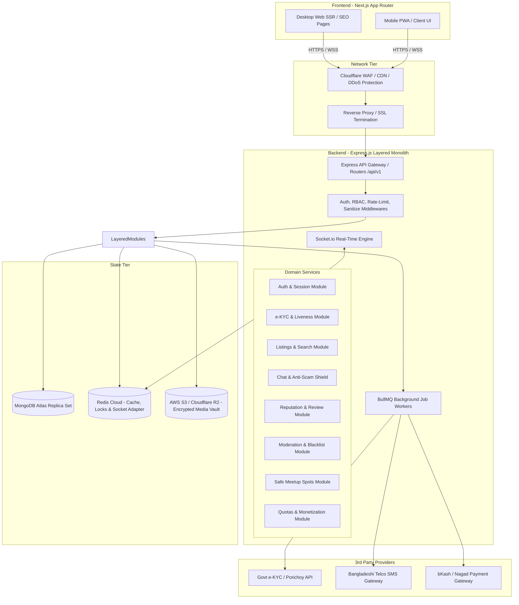
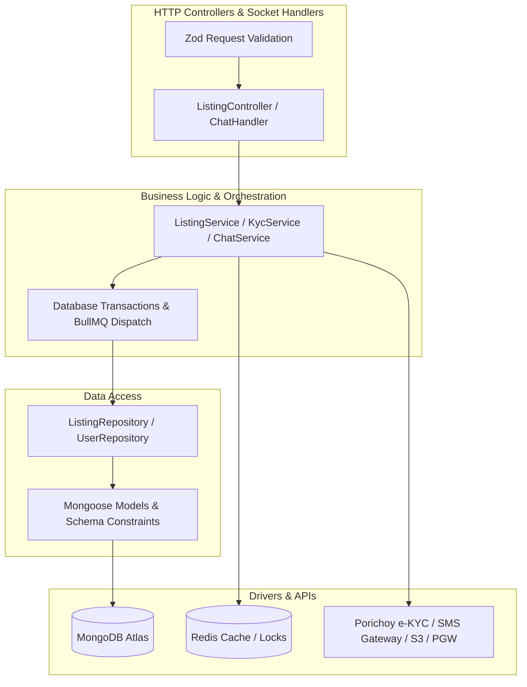
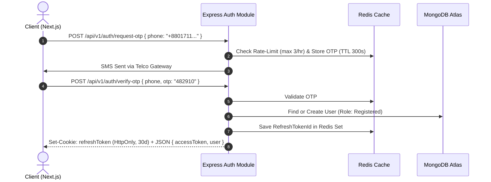
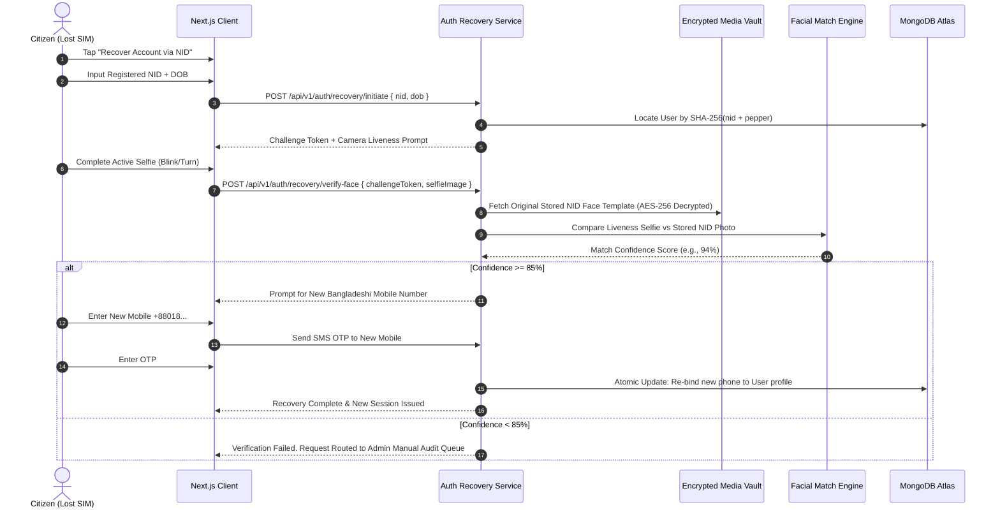
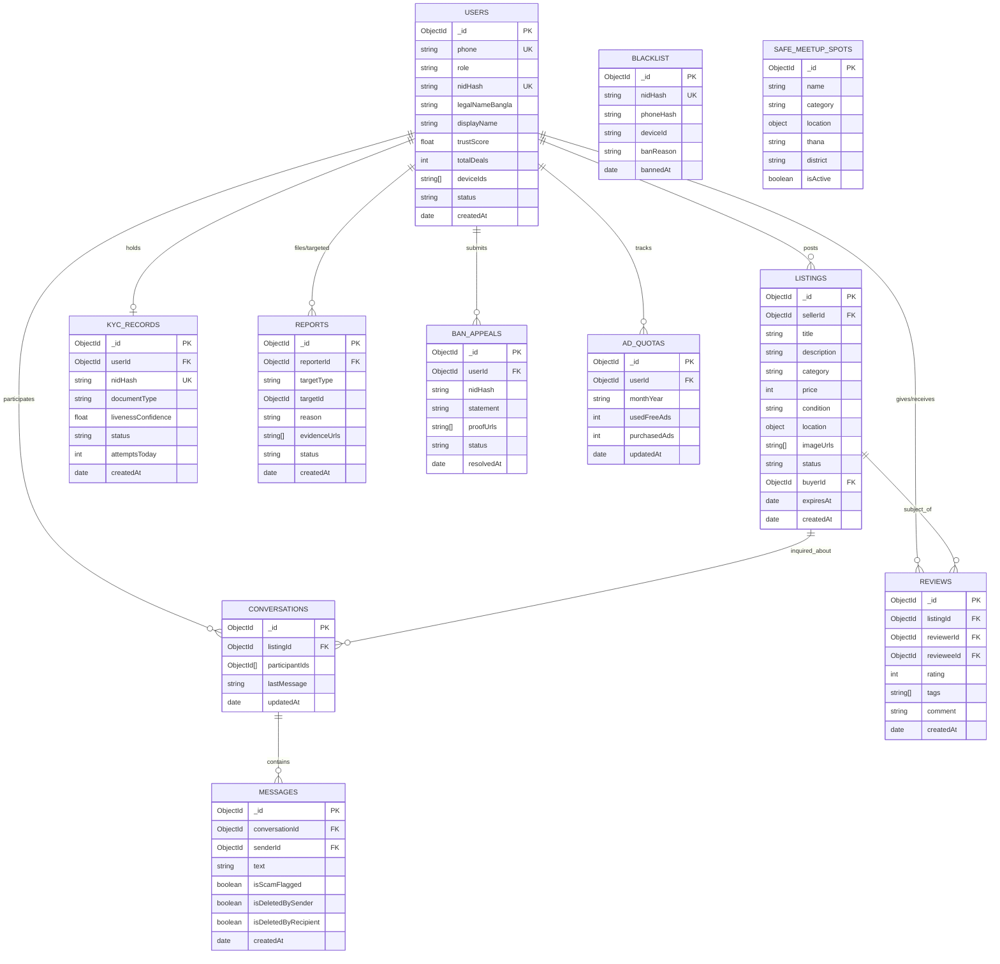

# SafeKroy (Amar-Bazar) — Technical System Architecture

**Document Reference:** `architecture.md`  
**Base Specification:** [`PRD.md`](file:///c:/Users/Tarikul/Documents/Amar-Bazar/PRD.md) (v1.2.0), [`prd-analysis.md`](file:///c:/Users/Tarikul/Documents/Amar-Bazar/prd-analysis.md), [`Requirement-Validation.md`](file:///c:/Users/Tarikul/Documents/Amar-Bazar/Requirement-Validation.md)  
**Architecture Paradigm:** Modular Layered Monolith (Clean / Onion Architecture)  
**Target Tech Stack:** Next.js 14+ (Frontend) + Express.js TypeScript (Backend) + MongoDB Atlas (Database)  
**Date:** September 15, 2026  
**Status:** Approved & Production-Ready  

---

## 1. High-Level System Architecture

SafeKroy is architected as a **Modular Layered Monolith**. This paradigm gives the team rapid delivery and simple single-codebase deployment, while preserving strict boundaries between domain modules (Auth, KYC, Listings, Chat, Moderation, Reviews, Safety Spots, Quotas).



---

## 2. Technology Stack & Component Rationale

| Layer | Selected Technology | Technical Justification |
| :--- | :--- | :--- |
| **Frontend Web** | **Next.js 14+ (App Router)** | Essential for Classifieds SEO (SSR/ISR for product listings), high Lighthouse performance, responsive mobile PWA experience, and built-in image optimization. |
| **Backend API** | **Express.js with TypeScript** | Battle-tested, ultra-low latency, enormous developer ecosystem in Bangladesh, seamless integration with Socket.io and Redis, and easily structured into clean layers. |
| **Primary Database** | **MongoDB Atlas (M10+)** | Perfect fit for flexible classified ad schemas (varying specs across Mobiles, Vehicles, Properties), native geospatial queries (`$near`, `2dsphere`), and high write throughput. |
| **Cache & Real-Time Adapter** | **Redis (v7+)** | Handles session tokens, distributed locks (`Redis Mutex`), Socket.io multi-node broadcasting, rate-limiting, and BullMQ queues. |
| **Job Queue / Background** | **BullMQ (Redis-backed)** | Guarantees non-blocking async operations: e-KYC upstream retries, transactional SMS dispatch, image watermarking, and ad expiration cron jobs. |
| **Real-Time Messaging** | **Socket.io + Redis Pub/Sub** | Sub-100ms real-time chat, in-memory anti-scam regex keyword filtering, typing indicators, and instant admin ban broadcast. |
| **Object Storage** | **AWS S3 / Cloudflare R2** | Private bucket storage with AES-256 encryption for raw NID documents, and public CDN distribution for watermarked ad photos. |
| **Image Processing** | **Sharp.js (Node.js)** | High-speed server-side image compression to WebP and dynamic watermarking with `SafeKroy — ID #XXXXXX`. |
| **Offline Chat Sync** | **Dexie.js (IndexedDB)** | Browser client message persistence ensuring unsent messages survive spotty Bangladeshi 3G/4G connectivity and auto-retry on reconnect. |
| **Request Validation** | **Zod** | Type-safe runtime schema validation shared across API controllers and frontend forms. |

---

## 3. Backend Layered Monolith Architecture

The backend code is organized into a **4-Layer Clean Architecture** (Presentation, Application/Service, Persistence/Repository, Infrastructure/External), strictly enforcing single-direction dependency flow.

```
src/
├── server.ts                  # Server entry point, Socket.io initialization
├── app.ts                     # Express application configuration & global middlewares
├── config/                    # Environment, Database (Mongoose), Redis, S3 config
│   ├── env.ts
│   ├── database.ts
│   └── redis.ts
├── shared/                    # Reusable cross-cutting concerns
│   ├── middleware/            # Auth, RBAC, RateLimiter, Validator, ErrorHandler
│   ├── errors/                # AppError, BadRequestError, UnauthorizedError, etc.
│   ├── utils/                 # Crypto (Salted SHA-256, AES-256), Regex patterns
│   └── queues/                # BullMQ queue definitions and worker orchestrators
└── modules/                   # Domain Feature Modules
    ├── auth/                  # Phone OTP, JWT, Session management
    ├── kyc/                   # NID e-KYC, Porichoy client, Facial liveness
    ├── users/                 # Profiles, Device fingerprints, Trust scores
    ├── listings/              # Ads, Categories, Search, Auto-watermarking
    ├── chat/                  # Socket.io handlers, Room management, Anti-scam filter
    ├── reviews/               # 1-5 Star rating, Community Trust score calculation
    ├── moderation/            # Reports, Circuit breaker, Ban appeals, Blacklist
    ├── safespots/             # Geospatial safe meetup spots search
    └── quotas/                # Fair use ad quotas, Monetization, bKash/Nagad PGW
```

### 3.1 Layer Responsibilities



1. **Presentation Layer (`*.controller.ts` & `*.routes.ts`):** Parses incoming HTTP requests, enforces Zod schema validation, handles HTTP status codes, and returns standardized JSON responses.
2. **Application / Service Layer (`*.service.ts`):** Houses pure business logic, enforces fair use quotas (2 free ads/mo), coordinates multi-step operations (e.g., mark sold $\rightarrow$ trigger review prompt), and enqueues background jobs.
3. **Repository Layer (`*.repository.ts`):** Encapsulates all Mongoose queries, aggregations, and atomic updates. Services never write raw Mongoose queries directly.
4. **Data Model Layer (`*.model.ts`):** Defines Mongoose schemas, document interfaces, validation rules, and indexes.

---

## 4. In-Depth Service Design & Implementation Patterns

### 4.1 Authentication & Authorization Strategy

#### Hybrid Dual-Token via HttpOnly Cookies
* **The Problem:** Storing JWTs in browser `localStorage` leaves users vulnerable to Cross-Site Scripting (XSS) token theft. Storing session IDs in databases creates heavy query overhead.
* **The Architecture:**
  1. **Access Token (Short-lived: 15 minutes):** Signed JWT containing `{ userId, role, isNidVerified, deviceId }`. Stored in memory or secure `SameSite=Lax` HttpOnly cookie.
  2. **Refresh Token (Long-lived: 30 days):** Opaque cryptographic random token stored in an **HttpOnly, Secure, SameSite=Strict cookie**. The hash of the refresh token is stored in Redis: `Key: refresh:{userId}:{tokenId}`.
  3. **Refresh Token Rotation (RTR):** Every time the client requests a new access token, the old refresh token is invalidated, and a new one is issued. If an invalidated refresh token is reused, all active sessions for that user are immediately purged from Redis (detecting token theft).
  4. **Device Fingerprinting Binding:** Each session captures `User-Agent`, IP subnet, and client Canvas/Hardware hash. Sudden device changes trigger re-verification via SMS OTP.



---

### 4.2 e-KYC & Identity Verification Pipeline

#### Asynchronous Worker Queue with Fallback Retries
* **The Problem:** Government Election Commission and Porichoy APIs frequently experience latency spikes (3 to 15 seconds) or temporary 502/504 downtime. Direct synchronous API calls in the HTTP request thread freeze the user's browser and cause server connection pool exhaustion.
* **The Architecture:**
  1. **Frontend Instant Ack:** When the user enters NID details and uploads their liveness selfie, the controller validates inputs, acquires a Redis mutex lock (`SET lock:kyc:{userId} 1 EX 30 NX`), marks the user's KYC status as `PROCESSING`, and returns HTTP 202 Accepted.
  2. **BullMQ Background Worker:** Dispatches the job to `kyc-processing-queue`.
  3. **NID Format Normalization:**
     - If 10 digits $\rightarrow$ Smart Card.
     - If 13 digits $\rightarrow$ Extract birth year from DOB (e.g. 1998) and auto-prefix to make 17 digits (`1998XXXXXXXXXXXXX`).
     - If 17 digits $\rightarrow$ Pass as-is.
  4. **Liveness & Biometric Face Match:** The worker calls the facial recognition engine (Porichoy / AWS Rekognition) comparing the selfie against the official NID photo. Confidence threshold $\ge 85\%$.
  5. **Completion & Real-time Webhook/Socket:**
     - On Success: System stores `SHA-256(NID + Salt)`, assigns `Verified Citizen` role, generates a green badge, and sends an in-app Socket.io event + Push Notification.
     - On Provider Downtime (5xx): The worker automatically re-queues the job with exponential backoff (retry after 2m, 5m, 15m) without failing the user's verification.

---

### 4.3 Real-Time C2C Chat & Anti-Scam Shield

#### Redis Adapter + In-Memory Regex Interceptor
* **The Problem:** Incumbent platforms allow scammers to freely share bKash numbers and demand advance courier booking fees.
* **The Architecture:**
  1. **Socket.io Cluster:** Socket connections authenticated via the client's JWT access token. Clustered across Node instances using `@socket.io/redis-adapter`.
  2. **In-Flight Message Interceptor Pipeline:** Before any message is saved to MongoDB or delivered to the recipient, it passes through a high-performance synchronous regex interceptor:
     ```typescript
     const SCAM_PATTERNS = [
       /(?:bKash|bkash|নগদ|nagad|rocket|রকেট)/i,
       /(?:advance|agrim|অগ্রিম|booking|বুকিং|courier charge|কুরিয়ার চার্জ)/i,
       /(?:\+?88)?01[3-9]\d{8}/ // Phone / Mobile Wallet format
     ];
     ```
  3. **Interception Behavior:**
     - If scam keywords are detected, the message is **flagged**.
     - An unskippable real-time safety banner payload is sent to the sender and recipient:
       `{ type: "SCAM_WARNING", message: "Do not send advance money. Always inspect goods in person." }`
     - If a seller repeatedly triggers this filter ($\ge 3$ times), their account is automatically restricted and placed in the Moderator Urgent Audit Queue.
  4. **90-Day Legal Audit Vault:** Deleted messages are soft-deleted from the user's UI view but preserved in an encrypted audit collection for 90 days for law enforcement coordination (CID/DB).

---

### 4.4 Media Storage & Dynamic Watermarking Pipeline

#### Two-Phase Upload with Sharp.js Server-Side Watermark
* **The Problem:** Scammers steal images from official websites or Facebook and post them as authentic second-hand items.
* **The Architecture:**
  1. User selects 1–5 images on the Next.js frontend. Images are compressed client-side (max 1920px).
  2. Images are uploaded to backend via `multipart/form-data` (or pre-signed S3 staging URLs).
  3. **Sharp Processing Worker:**
     - Resizes image to optimal responsive breakpoints.
     - Converts to high-efficiency `.webp` format (quality: 80).
     - Burns a dynamic, semi-transparent watermark onto the image:
       `"SafeKroy — ID #${listingId} — Verified Seller"`
     - Uploads processed image to public S3/R2 CDN bucket.
     - Deletes raw upload from temporary storage.

---

### 4.5 Listing Lifecycle, Quota & Re-moderation Service Design

#### Monthly Fair-Use Quotas & Re-moderation State Machine
* **Monthly Quota Enforcement:**
  - Tracked via Redis key: `quota:user:{userId}:{YYYY-MM}`.
  - Initialized to 0. If count $< 2$, listing is created for free and counter is incremented.
  - If count $\ge 2$, user is prompted to buy an extra ad slot via bKash/Nagad PGW (BDT 50–100).
* **Anti-Clickbait Price Floor Validator:**
  - Applied in Zod request validation pipeline against category minimums (Smartphones: 1,000 BDT; Laptops: 3,000 BDT; Motorbikes: 20,000 BDT).
* **Re-Moderation Trigger State Machine:**
  - If an active listing's `title`, `category`, `imageUrls`, or `price` ($\Delta > 30\%$) are updated, the ad state immediately flips from `ACTIVE` to `PENDING_REMODERATION`.
  - The previous version is paused from public search until re-approved by automated text/image scan or a human moderator.
* **Deal Closure ("Mark as Sold") Transaction:**
  - Executes as an atomic MongoDB session:
    1. Sets listing status to `SOLD` and stores `buyerId`.
    2. Closes other open conversations for this listing with an automated system toast: *"This item has been sold."*
    3. Enqueues a BullMQ job to send mutual review prompt notifications to both buyer and seller.

---

### 4.6 Reputation & Review Engine Service Design

#### Deal-Linked Mutual Reviews & Bayesian Trust Score
* **Review Gatekeeper:**
  - Reviews can **only** be submitted if a closed transaction exists where the user was either the seller or the selected buyer.
  - Review window: 14 days following deal closure.
* **Community Trust Score Calculation:**
  To prevent gaming by accounts with only 1 or 2 artificial reviews, SafeKroy uses a weighted Bayesian rating formula:
  $$W = \frac{R \cdot v + C \cdot m}{v + m}$$
  where:
  - $R$ = User's average rating from reviews.
  - $v$ = Number of verified ratings received.
  - $m$ = Minimum rating threshold weight (set to 5 ratings).
  - $C$ = Platform baseline mean rating (default 4.5).
  - Deductions applied for verified fraud reports or severe moderation warnings.

---

### 4.7 SIM Replacement & Biometric Account Recovery Service Design



---

### 4.8 Trust, Safety, Moderation & Ban Appeal Service Design

* **Automated Circuit Breaker:**
  - Implemented using a Redis sliding-window counter: `INCR report:listing:{listingId}` with a 10-minute TTL.
  - If count reaches $\ge 3$ unique verified user reports, the system automatically:
    1. Flips listing status to `TEMPORARILY_SUPPRESSED`.
    2. Drops the listing from public search and caches.
    3. Emits an urgent WebSocket alert to the Moderator Dashboard.
* **Ban Appeal Queue (48-Hour SLA):**
  - Banned users access a dedicated form: statement + document uploads.
  - Stored in `BAN_APPEALS` collection with automated SLA timer.
  - Moderator decisions (Upheld / Rejected) log full audit history.
* **Immutable Blacklist Vault:**
  - When a scammer is banned, their salted NID hash, phone hash, and hardware device fingerprints are inserted into the `BLACKLIST` collection.
  - Registration and KYC endpoints query this collection on index before invoking external e-KYC APIs.

---

### 4.9 Anti-Scraping Phone Number Reveal Architecture

* **The Problem:** Automated crawlers scrape classified listings to build telemarketing spam lists.
* **The Architecture:**
  1. Phone numbers are never included in initial server-side rendered HTML responses.
  2. Verified users must click **"Reveal Phone Number"**, triggering `POST /api/v1/listings/:id/reveal-contact`.
  3. **Redis Rate Limiter:** Key `reveal:user:{userId}` with rolling 24-hour TTL. Max **5 reveals per user per day**.
  4. Response returns an ephemeral dynamic SVG image or one-time revealed token, making bulk automated crawling infeasible.

---

### 4.10 Safe Meetup Suggester Service

* **Geospatial Safe Spot Engine:**
  - Stores verified crowded, CCTV-equipped public meeting locations (Dhaka Metro Rail Stations, Shopping Mall Food Courts, Police Station vicinities).
  - Queried via MongoDB `$near` geospatial operator on a `2dsphere` index against the listing or user's selected Thana:
  ```typescript
  const nearbySpots = await SafeSpotModel.find({
    location: {
      $near: {
        $geometry: { type: "Point", coordinates: [buyerLng, buyerLat] },
        $maxDistance: 5000 // 5km radius
      }
    },
    isActive: true
  }).limit(5);
  ```

---

## 5. MongoDB Atlas Database Architecture & Schemas

### 5.1 Comprehensive Collection ERD



---

### 5.2 TypeScript Interfaces & Mongoose Schemas

#### 1. User Model (`src/modules/users/user.model.ts`)
```typescript
import { Schema, model, Document, Types } from "mongoose";

export interface IUser extends Document {
  phone: string;
  role: "guest" | "registered" | "verified" | "moderator" | "superadmin";
  nidHash?: string;
  legalNameBangla?: string;
  displayName: string;
  trustScore: number;
  totalDeals: number;
  totalReviews: number;
  deviceIds: string[];
  status: "active" | "quarantined" | "suspended" | "banned";
  banReason?: string;
  lastActiveAt: Date;
  createdAt: Date;
  updatedAt: Date;
}

const userSchema = new Schema<IUser>(
  {
    phone: { type: String, required: true, unique: true, index: true },
    role: { type: String, enum: ["guest", "registered", "verified", "moderator", "superadmin"], default: "registered" },
    nidHash: { type: String, unique: true, sparse: true, index: true },
    legalNameBangla: { type: String },
    displayName: { type: String, required: true },
    trustScore: { type: Number, default: 5.0 },
    totalDeals: { type: Number, default: 0 },
    totalReviews: { type: Number, default: 0 },
    deviceIds: [{ type: String, index: true }],
    status: { type: String, enum: ["active", "quarantined", "suspended", "banned"], default: "active", index: true },
    banReason: { type: String },
    lastActiveAt: { type: Date, default: Date.now }
  },
  { timestamps: true }
);

export const UserModel = model<IUser>("User", userSchema);
```

#### 2. Listing Model (`src/modules/listings/listing.model.ts`)
```typescript
export interface IListing extends Document {
  sellerId: Types.ObjectId;
  title: string;
  description: string;
  category: "smartphones" | "laptops" | "motorbikes" | "electronics" | "others";
  subcategory?: string;
  price: number;
  condition: "Like New" | "Good" | "Fair" | "For Parts";
  location: {
    type: "Point";
    coordinates: [number, number]; // [longitude, latitude]
    division: string;
    district: string;
    thana: string;
  };
  imageUrls: string[];
  status: "active" | "pending_remod" | "reserved" | "sold" | "temporarily_suppressed";
  buyerId?: Types.ObjectId;
  remodReason?: string;
  isFeatured: boolean;
  isUrgent: boolean;
  reportCount: number;
  expiresAt: Date;
  createdAt: Date;
}

const listingSchema = new Schema<IListing>(
  {
    sellerId: { type: Schema.Types.ObjectId, ref: "User", required: true, index: true },
    title: { type: String, required: true, maxlength: 80 },
    description: { type: String, required: true, maxlength: 2000 },
    category: { type: String, required: true, index: true },
    subcategory: { type: String },
    price: { type: Number, required: true, index: true },
    condition: { type: String, enum: ["Like New", "Good", "Fair", "For Parts"], required: true },
    location: {
      type: { type: String, enum: ["Point"], default: "Point" },
      coordinates: { type: [Number], required: true },
      division: { type: String, required: true },
      district: { type: String, required: true },
      thana: { type: String, required: true, index: true }
    },
    imageUrls: [{ type: String, required: true }],
    status: {
      type: String,
      enum: ["active", "pending_remod", "reserved", "sold", "temporarily_suppressed"],
      default: "active",
      index: true
    },
    buyerId: { type: Schema.Types.ObjectId, ref: "User" },
    remodReason: { type: String },
    isFeatured: { type: Boolean, default: false, index: true },
    isUrgent: { type: Boolean, default: false },
    reportCount: { type: Number, default: 0 },
    expiresAt: { type: Date, required: true, index: { expires: 0 } } // 30-day TTL index
  },
  { timestamps: true }
);

listingSchema.index({ "location": "2dsphere" });
listingSchema.index({ title: "text", description: "text" }, { weights: { title: 5, description: 1 } });
listingSchema.index({ status: 1, category: 1, "location.thana": 1, createdAt: -1 });

export const ListingModel = model<IListing>("Listing", listingSchema);
```

#### 3. Conversation & Message Models (`src/modules/chat/chat.model.ts`)
```typescript
export interface IMessage extends Document {
  conversationId: Types.ObjectId;
  senderId: Types.ObjectId;
  text: string;
  isScamFlagged: boolean;
  flaggedKeywords: string[];
  isDeletedBySender: boolean;
  isDeletedByRecipient: boolean;
  createdAt: Date;
}

const messageSchema = new Schema<IMessage>(
  {
    conversationId: { type: Schema.Types.ObjectId, ref: "Conversation", required: true, index: true },
    senderId: { type: Schema.Types.ObjectId, ref: "User", required: true },
    text: { type: String, required: true, maxlength: 1000 },
    isScamFlagged: { type: Boolean, default: false, index: true },
    flaggedKeywords: [{ type: String }],
    isDeletedBySender: { type: Boolean, default: false },
    isDeletedByRecipient: { type: Boolean, default: false }
  },
  { timestamps: true }
);

messageSchema.index({ conversationId: 1, createdAt: 1 });
export const MessageModel = model<IMessage>("Message", messageSchema);
```

#### 4. Blacklist & Security Vault Model (`src/modules/moderation/blacklist.model.ts`)
```typescript
export interface IBlacklist extends Document {
  nidHash: string;
  phoneHash: string;
  deviceId?: string;
  banReason: string;
  bannedBy: Types.ObjectId;
  bannedAt: Date;
}

const blacklistSchema = new Schema<IBlacklist>(
  {
    nidHash: { type: String, required: true, unique: true, index: true },
    phoneHash: { type: String, required: true, index: true },
    deviceId: { type: String, index: true },
    banReason: { type: String, required: true },
    bannedBy: { type: Schema.Types.ObjectId, ref: "User", required: true },
    bannedAt: { type: Date, default: Date.now }
  },
  { timestamps: true }
);

export const BlacklistModel = model<IBlacklist>("Blacklist", blacklistSchema);
```

---

## 6. Frontend Architecture (Next.js App Router)

```
frontend/
├── src/
│   ├── app/
│   │   ├── (public)/                 # Public SSR SEO routes
│   │   │   ├── page.tsx              # Marketplace Homepage (Featured, Categories, Geo-selector)
│   │   │   ├── listings/             # Classifieds search & browsing (SSR/ISR)
│   │   │   │   ├── page.tsx          # Faceted search & filter results
│   │   │   │   └── [id]/page.tsx     # Product Details Page (Dynamic SEO metadata)
│   │   ├── (auth)/                   # Authentication routes
│   │   │   ├── login/page.tsx        # Phone OTP Login
│   │   │   ├── verify-nid/page.tsx   # e-KYC & Camera Liveness Capture
│   │   │   └── recover/page.tsx      # Biometric Account Recovery
│   │   ├── (dashboard)/              # Protected User & Seller Portal
│   │   │   ├── post-ad/page.tsx      # Multi-step Ad Creation with client validation
│   │   │   ├── my-ads/page.tsx       # Ad status, Edit, Mark as Sold
│   │   │   └── messages/page.tsx     # Real-Time C2C Chat Interface
│   │   └── (admin)/                  # Moderator & Admin Portal
│   │       ├── queue/page.tsx        # Urgent report & circuit-breaker queue
│   │       ├── appeals/page.tsx      # Ban appeal dispute queue (48h SLA)
│   │       └── blacklist/page.tsx    # NID and Device blacklisting
│   ├── components/                   # Reusable UI component library
│   │   ├── ui/                       # Modals, Buttons, Inputs, Badges (Verified Badge)
│   │   ├── listings/                 # AdCard, PriceFilter, ThanaPicker, ImageGallery
│   │   └── chat/                     # ChatWindow, ScamWarningModal, MeetupSuggester
│   ├── hooks/                        # Custom React Hooks (useSocket, useAuth, useGeolocation)
│   └── lib/                          # API clients, IndexedDB (Dexie) db instance, Socket
```

---

## 7. Security, PII Cryptography & Compliance Architecture

### 7.1 Cryptographic Storage of Identity (Cyber Security Act 2023)
* **Zero Plaintext Storage:** National ID numbers are **never stored in plain text**.
  $$\text{Stored Hash} = \text{HMAC-SHA256}(\text{NID\_Number}, \text{SERVER\_PEPPER})$$
* **Biometric Media Vault:**
  - Raw NID images and selfie frames are encrypted at rest with **AES-256-GCM**.
  - Held in a zero-public-access S3 bucket with strict IAM roles.
  - Access is granted exclusively to KYC workers via **Pre-Signed URLs with a 60-second Time-to-Live (TTL)**.
* **Audit Trail Preservation:** When users delete their accounts, their personal names and emails are removed, but their **Salted NID Hash and fraud records are permanently retained** for law enforcement compliance (CID/DB).

### 7.2 Anti-Scraping Phone Number Protection
* Phone numbers are never rendered in initial HTML bundles.
* Unlocked via client `POST /api/v1/listings/:id/reveal-contact`.
* Backend enforces a Redis rate-limit: **Maximum 5 reveals per verified citizen per 24-hour rolling window**.

---

## 8. Resilience, Error Recovery & Edge Case Architecture

| Edge Case / Error | Architectural Mitigation Pattern | Implementation Detail |
| :--- | :--- | :--- |
| **EC-01: 13-Digit Legacy NID** | Normalizer Express Middleware | Backend auto-extracts birth year from DOB and prepends `YYYY` to make 17 digits before calling e-KYC. |
| **EC-02: Bilingual Name Mismatch** | Non-string Identity Binding | Auth binds strictly to NID + DOB + Liveness. Verified Bengali legal name from EC database auto-populates uneditable field. |
| **EH-01: e-KYC Gateway 502/504** | BullMQ Async Job Queue | User receives instant HTTP 202; worker retries with exponential backoff; pushes notification upon completion. |
| **EH-02: Telco SMS Delay** | Multi-Channel Fallback Worker | 60-second countdown triggers "Send via WhatsApp" or "Voice Call OTP" options. |
| **EH-03: Upload Drop on 3G/4G** | Chunked Resumable Upload | Client uses tus-protocol / chunked S3 multi-part uploads; form state preserved in local IndexedDB. |
| **EX-01: Chat vs "Sold" Race** | MongoDB Document Lock | Atomic session `findOneAndUpdate({ _id, status: 'active' }, ...)` rejects simultaneous chat creation on sold ads. |
| **EX-02: Duplicate KYC Race** | Redis Distributed Mutex | `SET lock:kyc:{userId} 1 EX 30 NX` rejects concurrent submissions with HTTP 429 Too Many Requests. |
| **EX-03: Active Chat with Banned Scammer** | WebSocket Forced Termination | Socket.io server broadcasts `FORCE_CHAT_TERMINATION` to room, freezes chat UI, and alerts the victim. |
| **EX-05: Mass-Reported Ad** | Redis Sliding Window Breaker | `INCR report:listing:{id}` with 10-minute TTL; if count $\ge 3$, flips ad to `TEMPORARILY_SUPPRESSED`. |

---

## 9. Deployment, Infrastructure & Monitoring Blueprint

```
                      Production Deployment Architecture
                                      │
              ┌───────────────────────┴───────────────────────┐
              ▼                                               ▼
       Next.js Web (Vercel)                     Express API (Docker on AWS ECS / VPS)
       • Edge Caching for Listings              • Node.js TypeScript Cluster
       • Global CDN for Assets                  • Socket.io with Redis Adapter
              │                                               │
              └───────────────────────┬───────────────────────┘
                                      ▼
                             State & Data Tier
              ┌───────────────────────┼───────────────────────┐
              ▼                       ▼                       ▼
      MongoDB Atlas M10+        Redis Cloud Enterprise     AWS S3 / Cloudflare R2
      • 3-Node Replica Set      • Cluster with Persistence • Encrypted Media Vault
      • Automated Backups       • Pub/Sub & Lock Engine    • Watermarked CDN Assets
```

### Logging & Monitoring Stack
1. **Application Logging:** Structured JSON logging via **Winston** / **Pino** sent to Datadog or CloudWatch.
2. **Error Tracking:** Real-time exception capture via **Sentry** with user context masking.
3. **Metrics & Uptime:** **Prometheus + Grafana** tracking p95 API latency, e-KYC gateway response times, and Socket.io connection counts.

---

## 10. Architectural Decision Records (ADR Summary)

1. **ADR-01: Auth Tokens:** Adopt **HttpOnly Secure Cookies with Refresh Token Rotation (RTR)** to eliminate XSS token exfiltration risks and simplify mobile session persistence.
2. **ADR-02: Database Engine:** Select **MongoDB Atlas** for its high write performance, flexible classified ad document schema, and native geospatial `2dsphere` query capabilities.
3. **ADR-03: e-KYC Queue:** Adopt an **asynchronous BullMQ worker queue** with instant client acknowledgement (HTTP 202) to shield the API gateway from upstream government latency spikes.
4. **ADR-04: Chat Anti-Scam:** Enforce an **in-memory synchronous regex interceptor** on the Socket.io pipeline before persistence, halting advance-payment fraud before delivery.
5. **ADR-05: Search Indexing:** Utilize **MongoDB Compound Text & Geospatial Indexes** for Phase 1 MVP, deferring Elasticsearch until catalog size exceeds 500,000 active listings.
