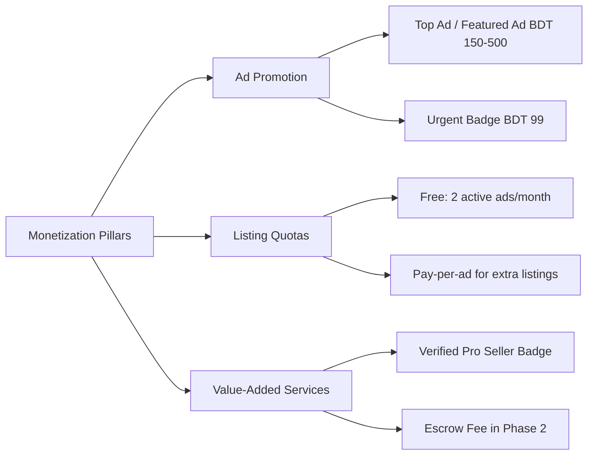

# SafeKroy (Amar-Bazar) — Comprehensive PRD & Business Analysis Report

**Prepared by:** Lead Product Analyst & Business Systems Architect  
**Document Reference:** `prd-analysis.md`  
**Base Document:** [`PRD.md`](file:///c:/Users/Tarikul/Documents/Amar-Bazar/PRD.md) & [`Idea.md`](file:///c:/Users/Tarikul/Documents/Amar-Bazar/Idea.md)  
**Date:** September 15, 2026  
**Status:** Under Stakeholder Review  

---

## 1. Executive Summary & Strategic Assessment

### 1.1 Product Positioning & Strategic Fit
The core hypothesis of **SafeKroy** — *introducing mandatory dual-sided National ID (NID/Smart Card) e-KYC verification to classifieds in Bangladesh* — directly addresses the single largest vulnerability of incumbents like Bikroy and Facebook Marketplace: **anonymity-driven fraud and advance-payment scams**.

```
    Incumbents (Bikroy / Facebook)               SafeKroy Strategic Advantage
┌────────────────────────────────────────┐   ┌────────────────────────────────────────┐
│ • Zero identity verification           │   │ • Mandatory Dual-Sided NID e-KYC       │
│ • Burner SIMs & throwaway FB accounts  │   │ • 1 NID = 1 Real Bangladeshi Identity   │
│ • Unregulated bKash advance scams      │   │ • Anti-scam chat triggers & masking    │
│ • Zero legal accountability            │   │ • Permanent NID-level ban / blacklist  │
└────────────────────────────────────────┘   └────────────────────────────────────────┘
```

### 1.2 Analyst Verdict
The value proposition is exceptionally strong for high-value pre-owned categories (Smartphones, Laptops, Motorbikes, Home Appliances). However, **identity verification alone does not prevent offline or off-platform fraud** unless backed by strict in-app chat safeguards, reputation scoring, and sustainable unit economics (managing API verification costs).

---

## 2. User Types, Roles & Permission Hierarchy

The original PRD defines basic Buyers and Sellers, but an enterprise-grade C2C marketplace requires a structured 5-tier role-based access control (RBAC) model:

| Role | Verification Status | Permissions & Capabilities | Limitations / Gates |
| :--- | :--- | :--- | :--- |
| **Guest / Anonymous** | None | Browse active listings, search, filter by location/category, view public ad specs. | Cannot post ads, cannot initiate chat, cannot view seller phone number, cannot save favorites. |
| **Registered User** | Mobile OTP Verified | Save favorites, configure notification preferences, view own profile, initiate NID verification. | Cannot post ads, cannot message sellers, cannot see seller contact details. |
| **Verified Citizen (C2C)** | NID e-KYC Verified | Full platform access: Post up to active quota limit, initiate in-app chat, request phone reveal, leave reviews, report listings. | Bound by fair usage ad quotas, chat moderation filters, and scam policies. |
| **Community Moderator** | Internal Staff | View flagged ads, review reported chats, approve/reject borderline listings, handle user appeals. | Cannot access raw NID biometric data; cannot execute database-level bans. |
| **Super Admin / Trust & Safety Officer** | Internal High Clearance | Full dashboard access, permanent NID blacklisting, audit logs, e-KYC vendor reconciliation, analytics. | Full accountability with immutable audit logging. |

---

## 3. Product & Business Goals

### 3.1 Primary Business Goals
1. **Trust Leadership:** Become the #1 recognized "scam-free" second-hand goods marketplace in urban Bangladesh (Dhaka, Chattogram, Sylhet) within 12 months.
2. **High-Value Liquidity:** Reach a median time-to-sell of under 7 days for smartphones and laptops.
3. **Low Dispute Rate:** Maintain an incident rate of less than 0.05% reported fraudulent encounters per 1,000 active chats.

### 3.2 Unit Economics & Monetization Roadmap (Missing in initial PRD)
Because third-party e-KYC (Porichoy API) incurs a direct cost per call (~BDT 2.00 to BDT 5.00 per verification), the platform cannot rely purely on infinite free usage without revenue streams.



---

## 4. Critical Gap Analysis & Missing Requirements

The following requirements and edge cases are currently **missing or underspecified** in the current [`PRD.md`](file:///c:/Users/Tarikul/Documents/Amar-Bazar/PRD.md):

### 4.1 The "Weaponized Trust Badge" Vulnerability (Highest Risk)
* **The Problem:** A verified seller with an official "NID Verified" badge can still trick a buyer into sending BDT 500–1,000 via bKash under the pretext of "Courier parcel booking fee" or "holding money," saying: *"Look, my profile has an official NID badge, you can trust me!"*
* **Missing Requirement:**
  - **In-Chat Keyword Interceptor:** Instant regex detection of phone numbers, bKash/Nagad/Rocket account patterns, and trigger words (`advance`, `booking`, `agrim`, `taka pathan`, `courier charge`).
  - **System Interstitial Warning:** When a user attempts to send payment keywords, an unskippable modal warning must appear: *"SafeKroy Warning: NEVER send advance money. Verified NID does not guarantee courier delivery. Handover in person only."*

### 4.2 e-KYC Edge Cases & Demographics in Bangladesh
* **Old (Laminated 13/17-digit) vs. Smart (10-digit) NID:** Many Bangladeshi citizens still possess non-smart paper NIDs or have discrepancies in Bengali vs. English name transliteration.
* **Under-18 Tech Users:** College students (<18 years old) who buy/sell used phones or books do not possess an NID. Does the platform allow Birth Certificate (BRIS) or Student ID, or are they strictly barred?
* **Cost Absorption Strategy:** If unverified buyers must verify before sending 1 message, casual buyers may abandon the platform, wasting the e-KYC API fee.
  - *Recommendation:* Allow buyers to verify during signup or delay NID verification until the 1st chat initiation, with 1 free lifetime verification per phone/device.

### 4.3 1-to-1 Identity Binding & Account Lifecycle
* **1 NID = 1 Account Policy:** What happens if a user loses their SIM card or wants to change their mobile number?
* **Account Recovery Process:** If an account is banned, the NID must be permanently blacklisted. If a legitimate user is SIM-swapped, there must be a biometric/facial liveness verification recovery flow.

### 4.4 Missing Post-Transaction Reputation & Review Engine
* The current PRD only has binary verification (Verified vs Unverified). It lacks a **Peer Review System**.
* **Missing Requirement:**
  - When a seller marks an ad as "Sold", they select the buyer from their active chat list.
  - Both buyer and seller receive a prompt to rate the interaction (1–5 Stars + Tags: *Accurate Description*, *Punctual Meetup*, *Polite*, *Suspicious Haggling*).
  - Builds community trust equity over time.

### 4.5 Content Abuse & Stolen Image Detection
* Scammers frequently download product photos from Daraz or official websites and pretend they possess the physical used device.
* **Missing Requirement:**
  - Mandatory upload of at least 1 photo taken directly with the in-app camera showing the physical item.
  - Automatic platform watermarking (`SafeKroy — ID #XXXXXX`) across all uploaded photos to prevent re-uploading onto Facebook or other fraudulent sites.

---

## 5. Functional Requirements Deep Dive & Refinements

### 5.1 Identity & Verification Engine (Module 1 Refinements)
```
User Registration (Phone + SMS OTP)
             │
             ▼
   Browse Marketplace (Read Only)
             │
             ▼ [Triggers Post Ad or Contact Seller]
             │
    e-KYC Gateway (Porichoy / Election Commission)
    ├─ 10-digit Smart NID or 13/17-digit Legacy NID
    ├─ Date of Birth (DOB)
    └─ Facial Liveness Match (Selfie vs NID photo)
             │
             ├── Passed ──> Assign Green Badge & Unique Citizen Hash
             └── Failed ──> Retry (Max 3 attempts/24h) -> Manual Audit Queue
```

* **FR-1.6 Fraud Database Integration:** Hash all verified NID numbers with a salt. In case of police complaint or verified fraud, store the `NID_HASH` in an immutable blacklist table. Any future registration attempt matching this hash is immediately rejected and flagged.

### 5.2 Ad Management & Fair Usage (Module 2 Refinements)
* **FR-2.4 Fair Use Monthly Quotas:** To prevent grey-market commercial phone shops from flooding the C2C board, individual accounts receive **2 free active listings per month**. Additional listings require a micro-fee (BDT 50–100) or a "Verified Shop" plan.
* **FR-2.5 Item Condition Standardization:**
  - `Like New`: Flawless condition, original box and purchase memo available.
  - `Good`: Minor cosmetic scratches, 100% functional.
  - `Fair`: Visible wear and tear, battery health degraded, fully described in ad.
  - `For Parts / Faulty`: Device has known hardware defects.

### 5.3 In-App Negotiation & Safe Exchange (Module 4 Refinements)
* **FR-4.4 Safe Meetup Location Suggester:**
  - When users agree on a deal in chat, the app provides a "Suggest Safe Meeting Spot" button.
  - Recommends crowded, CCTV-monitored public areas (e.g., Metro Rail Stations, Shopping Mall Food Courts, Police Station Vicinity) within the agreed Thana.

---

## 6. Non-Functional Requirements & Bangladesh Infrastructure Realities

### 6.1 Regulatory & Legal Compliance
* **Cyber Security Act 2023 / ICT Act Compliance:** Raw NID images must not be retained on public-facing storage buckets. They must be processed ephemerally or encrypted with AES-256 keys held in a dedicated Key Management Service (KMS).
* **Law Enforcement Data Cooperation:** Secure audit trail for requests from Bangladesh Police / CID / DB regarding blacklisted scam actors.

### 6.2 Network & Performance Resilience
* **Low-Bandwidth Mobile Optimization:** 45% of users in Tier-2/Tier-3 districts browse on congested 3G/4G networks. All images must be automatically converted to progressive `.webp` format and capped at 250 KB per image.
* **Offline-First Chat Sync:** Messages must queue locally and automatically retry with exponential backoff on intermittent networks.

---

## 7. Strategic Questions & Clarifications for Stakeholders

Before advancing to system architecture and UI wireframing, the following key business and product decisions must be clarified:

```
                               Strategic Decision Tree
                                         │
        ┌───────────────────┬────────────┴────────────┬───────────────────┐
        ▼                   ▼                         ▼                   ▼
1. Under-18 Users?    2. Verification Cost?     3. Ad Quotas?       4. Transaction Model?
- Disallow (<18)       - 100% Free to user       - 2 Free/month      - Strictly offline
- Student ID/Birth     - Monetize via ads/promos - Pay per ad        - Phase 2 Escrow roadmap
  Certificate fallback
```

1. **Under-18 Users Policy:** Should teenagers/students without a National ID be permitted to use the platform via alternative verification (e.g., Student ID / Birth Certificate), or should SafeKroy strictly restrict access to 18+ NID holders?
2. **e-KYC Cost Model:** Each e-KYC query costs BDT 2–5. If 50,000 casual buyers sign up, verification expenses can reach BDT 100,000–250,000. Will the platform absorb 100% of this cost as user acquisition, or should verification only trigger when a user decides to post an ad / contact a seller?
3. **Monetization Priority:** What is the intended day-1 revenue stream? (e.g., Featured/Top listings, urgent badges, or paid ad slots beyond the monthly free quota?)
4. **Offline Handover Policy:** Should SafeKroy display a mandatory "No Advance Cash" agreement popup before unlocking buyer-seller chat?
